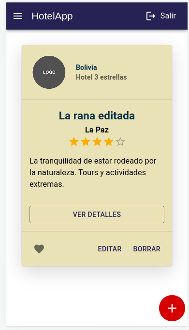

# Aplicación de registro de hoteles | ReactJS + TypeScript & Redux

Esta es mi solución a un reto planteado como prueba por parte de una empresa. El tiempo de desarrollo fue de 7 días, y las tecnologías usadas fueron React con TypeScript y Redux Toolkit como manejador de estado global.

Despliegue de la solución: [Despligue de Netlify](https://jpihotelapp.netlify.app/)

Para ejecutarlo localmente:

```
npm install
```

o

```
yarn install
```

Y luego:

```
npm run dev
```

o 

```
yarn run dev
```

## Tabla de contenidos

- [Aplicación de registro de hoteles | ReactJS + TypeScript & Redux](#aplicación-de-registro-de-hoteles--reactjs--typescript--redux)
  - [Tabla de contenidos](#tabla-de-contenidos)
  - [Resumen](#resumen)
    - [El reto](#el-reto)
    - [Pantallazo](#pantallazo)
    - [Enlaces](#enlaces)
  - [Mi proceso](#mi-proceso)
    - [Desarrollado con](#desarrollado-con)

## Resumen

### El reto

Los usuarios deberían poder:

- Registrarse a través con email y contraseña, o con GMail (se brindan ambas alternativas)
- Iniciar sesión con email y contraseña, o con GMail
- En este caso, no persistí la sesión de usuario mediante session storage, sino que, aprovechando que estaba implementando con Firebase, usé el Observable de onAuthStateChanged. 
- CRUD de hoteles con campos como nombre, descripción, país, etc.
- Cerrar sesión mediante la instrucción del SDK de Firebase.

### Pantallazo



### Enlaces

- URL de la solución: [Repositorio de GitHub](https://github.com/jisazamp/hotel-app)
- Despliegue de la solución: [Despligue de Netlify](https://jpihotelapp.netlify.app/)

## Mi proceso

### Desarrollado con

- [React](https://reactjs.org/) - Librería de JS
- [Styled Components](https://styled-components.com/) - Para estilos
- [MaterialUI](https://mui.com/) - Para estilos
- [Firebase](https://firebase.google.com/) - Como backend
- Redux Toolkit & React Redux
- Mobile-first workflow
